# social-network-api

## Description

The goal of this project was to create the back end API of a social media site. This back end API has the ability to keep track of user profiles, keeps tracks of a users thoughts, keeps track of reactions to user thoughts, and keeps a list of friends for each user. This application utilizes express.js for routing and uses MongoDB and Mongoose for creating a NoSQL database.

## Installation

You will need to open the terminal and run npm install to load in all necessary dependencies. Then run the command npm run seed to create and seed the database with a couple users and a thought. Once that is done the application should be ready to run.

## Usage

After installation is done you open the terminal and run the application with either node server.js or with npm run start. This will start and connect the server with the MongoDB database. From there you open insomniac and make your api fetch requests.

Below are screenshots showing insomnia requests being answered.

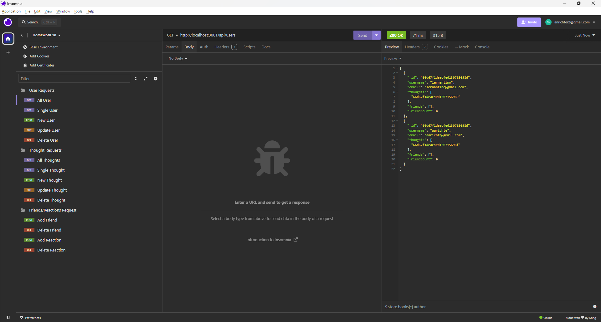

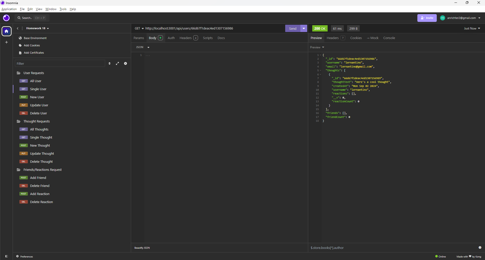

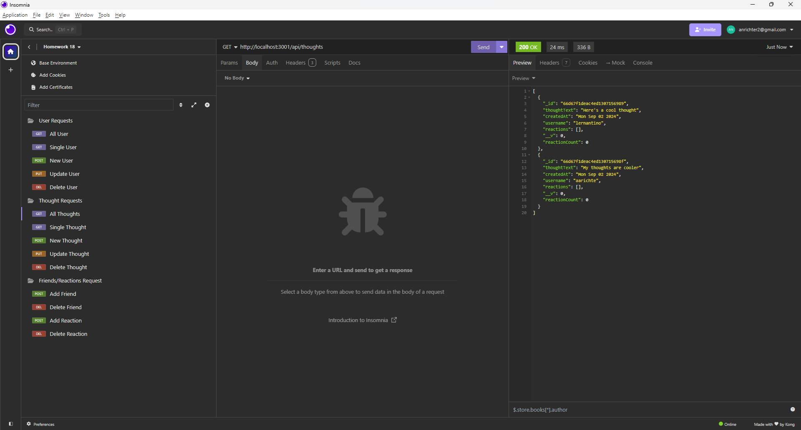

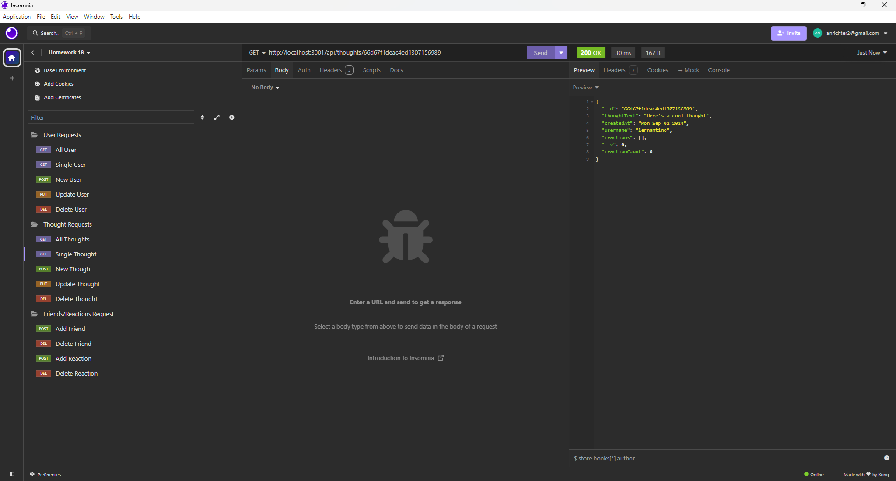

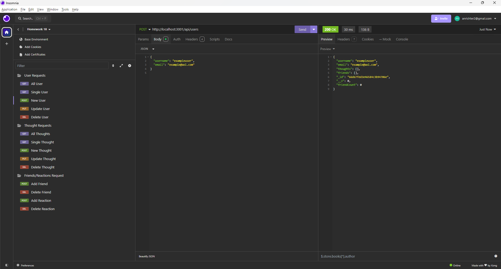

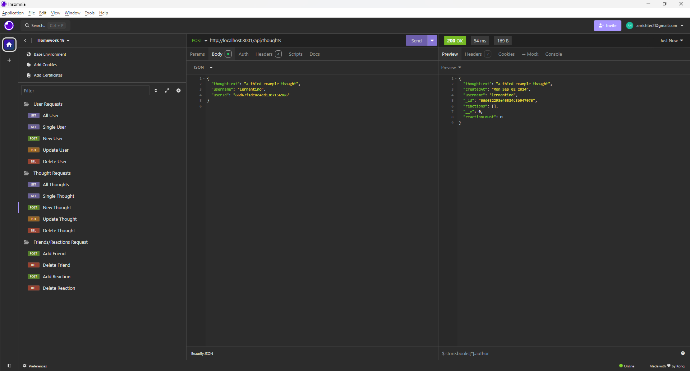

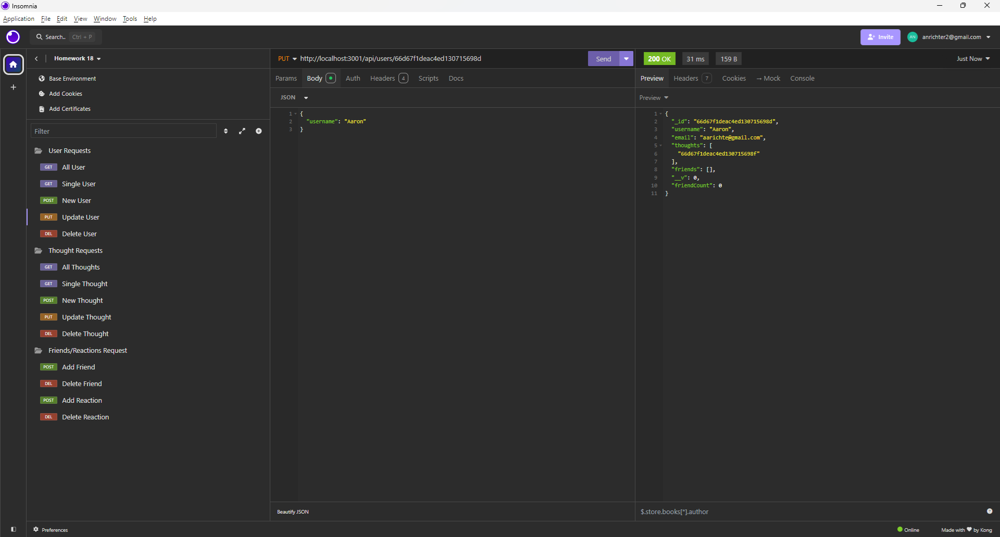

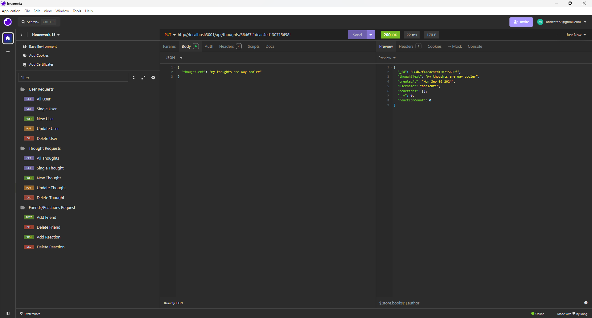

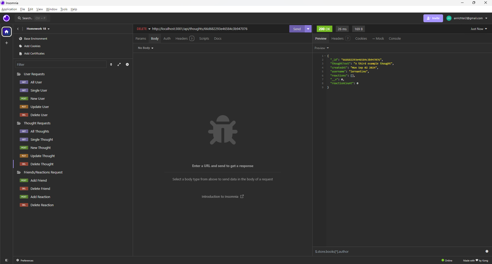

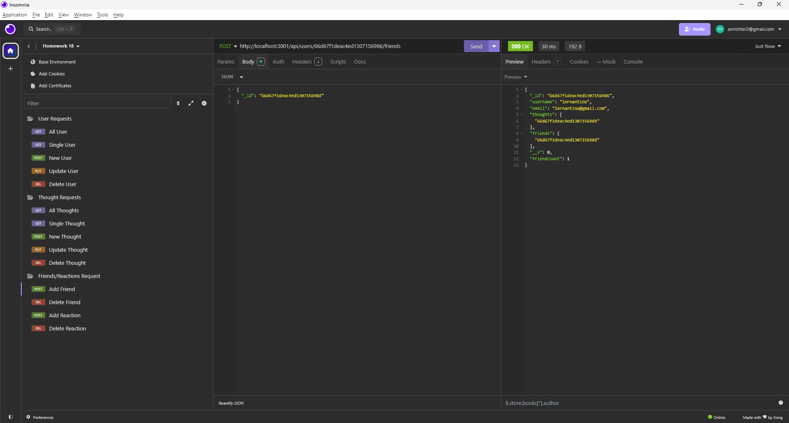

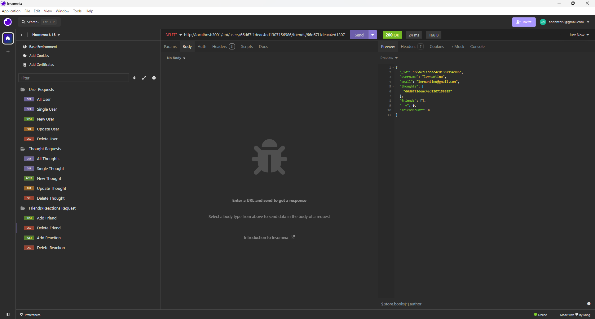

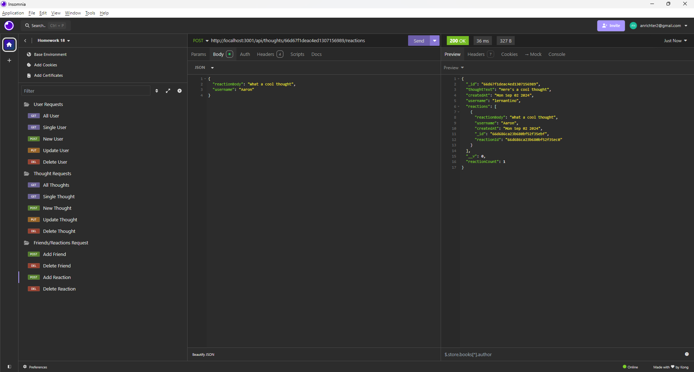

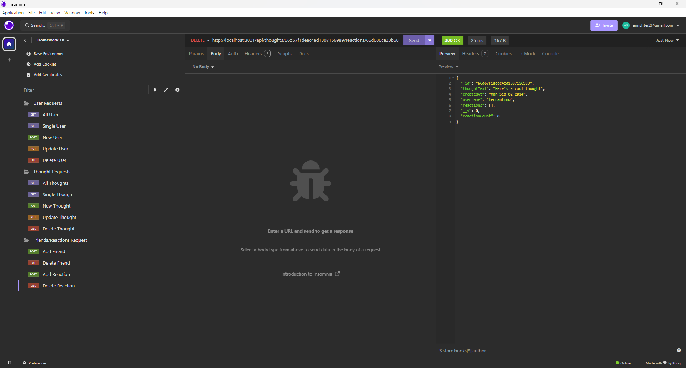

Link to a walkthrough video showing the application in action:
[Walkthrough Video]()

## Credits

N/A

## License

MIT

## Contribute

N/A
